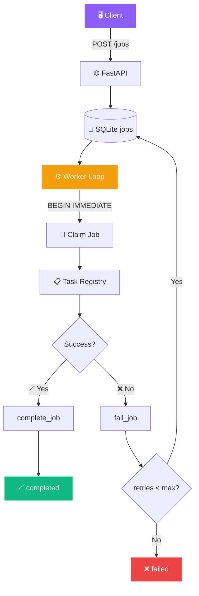

<!-- ═══════════════════════════════════════════════════════════════ -->
<!-- ⚙️ Background Job Queue — Pipeline Flow Animated README -->
<!-- ═══════════════════════════════════════════════════════════════ -->

<!-- ═══════ QUEUE-STYLE HEADER ═══════ -->
<div align="center">
  
</div>

<!-- ═══════ LIVE QUEUE INDICATOR ═══════ -->
<div align="center">
  
</div>

<br/>

<!-- ═══════ QUEUE PIPELINE VISUAL ═══════ -->
<div align="center">

<table border="0" cellspacing="8" cellpadding="12" width="90%">
<tr>
<td align="center" width="20%" bgcolor="#1a1b27">

### 📥 ENQUEUE


Client POST /jobs

</td>
<td align="center" width="5%">

➡️

</td>
<td align="center" width="20%" bgcolor="#1a1b27">

### ⚙️ PROCESSING


Worker claims job

</td>
<td align="center" width="5%">

➡️

</td>
<td align="center" width="20%" bgcolor="#1a1b27">

### ✅ DONE


Result persisted

</td>
<td align="center" width="5%">

or

</td>
<td align="center" width="20%" bgcolor="#1a1b27">

### ❌ FAILED


Retries exhausted

</td>
</tr>
</table>

</div>

<br/>

<!-- ═══════ WORKER LOOP ANIMATION ═══════ -->
<div align="center">

<table border="0" cellspacing="6" cellpadding="10" width="70%">
<tr>
<td align="center">


</td>
<td align="center">


</td>
<td align="center">


</td>
<td align="center">


</td>
</tr>
</table>

</div>

<br/>

<!-- ═══════ AI SCENES ═══════ -->
<div align="center">
  
  
  
</div>

<br/>

<!-- ═══════ LIVE BADGES ═══════ -->
<div align="center">
  <a href="https://github.com/sumit966/background-job-queue/stargazers">
    
  </a>
  <a href="https://github.com/sumit966/background-job-queue/network/members">
    
  </a>
  <a href="https://github.com/sumit966/background-job-queue/issues">
    
  </a>
  <a href="https://github.com/sumit966/background-job-queue/commits/main">
    
  </a>
</div>

<br/>

<div align="center">
  
  
  
  
  
</div>

<br/>

<div align="center">
  
  
  
  
</div>

<br/>

<div align="center">
  <i>⚙️ Backend Engineering Project · Author: <b>Sumit Raj</b> · M.Tech VNIT Nagpur · Ex-Salesforce</i>
</div>

<br/>


---

## 🎯 Overview


A **background job queue** that mirrors the design of **Celery / RQ** — but **without external infrastructure**:

<table>
<tr>
<td width="25%" align="center">

### 📥 Enqueue


job_type + payload

</td>
<td width="25%" align="center">

### 🎯 Priorities


Lower = higher priority

</td>
<td width="25%" align="center">

### 🔄 Retries


With max attempts

</td>
<td width="25%" align="center">

### 📊 Tracking


queued → running → done

</td>
</tr>
</table>

> **🎯 Purpose:** A **lightweight, production-aware queue** — no Redis, no worker fleets, just SQLite + FastAPI.

---

## ❌ Problem Statement

Background jobs are everywhere — sending emails, resizing images, generating reports, syncing data. Doing this **naively inside a web request** causes:

| ❌ Issue | Impact |
|---------|--------|
| 🐌 **Slow HTTP responses** | Poor UX |
| ⏰ **Timeouts under load** | 504 errors |
| 💥 **Lost jobs** when process crashes | Silent failures |
| 🙈 **No visibility** into failures | Can't debug |

> **Full Celery setups need Redis + worker fleets. Not ideal for small projects or demos.**

---

## ✅ Solution

A **lightweight, production-aware queue** that:

- 💾 **Uses SQLite** with row-level locking for atomic job claims
- 📝 **Persists every state change** (queued / running / completed / failed)
- 🎯 **Supports priorities** and retry limits per job
- 🌐 **Exposes a FastAPI surface** for enqueue, list, view, and stats
- ⚙️ **Runs the worker** either as a long-lived process or on-demand via API

> 💡 The architecture maps **1:1 to Celery/RQ**, so upgrading later is trivial.

---

## 🏗️ Architecture

### ⚙️ Queue + Worker Flow



### 📐 ASCII Fallback

```
Client (POST /jobs)
    |
    v
+-------------------+
|  SQLite jobs      |  status: queued
+---------+---------+
          |
          v
+-------------------+
|  Worker loop      |  atomically claims next job
|  (worker.py)      |  (BEGIN IMMEDIATE transaction)
+---------+---------+
          |
          v
+-------------------+
|  Task registry    |  send_email, process_image,
|  (tasks.py)       |  generate_report, flaky
+---------+---------+
          |
   success|failure
          v
+-------------------+   +-------------------+
| complete_job()    |   | fail_job()        |
| status=completed  |   | retries < max ->  |
| result=...        |   |   requeue         |
+-------------------+   | else -> failed    |
                        +-------------------+
```

---

## 🛠️ Tech Stack

<table align="center">
<tr>
<td><b>Category</b></td>
<td><b>Technologies</b></td>
</tr>
<tr>
<td>🌐 API</td>
<td>  </td>
</tr>
<tr>
<td>💾 Storage</td>
<td></td>
</tr>
<tr>
<td>⚙️ Worker</td>
<td></td>
</tr>
<tr>
<td>🔒 Concurrency</td>
<td></td>
</tr>
<tr>
<td>🧪 Testing</td>
<td> </td>
</tr>
<tr>
<td>🚀 Optional Upgrade</td>
<td>  </td>
</tr>
<tr>
<td>🐳 Container</td>
<td></td>
</tr>
<tr>
<td>⚙️ CI/CD</td>
<td></td>
</tr>
<tr>
<td>🐍 Language</td>
<td></td>
</tr>
</table>

---

## 📦 Project Structure

```
background-job-queue/
│
├── 🐍 src/
│   ├── __init__.py
│   ├── 💾 storage.py          # SQLite schema + queue operations
│   ├── 📋 tasks.py            # Task registry (job type → function)
│   └── ⚙️ worker.py           # Worker loop + graceful shutdown
│
├── 🌐 api/
│   ├── __init__.py
│   └── main.py                # FastAPI endpoints
│
├── 🧪 tests/
│   ├── __init__.py
│   └── test_api.py            # pytest tests
│
├── 📊 data/                    # SQLite db (git-ignored)
├── ⚙️ .github/workflows/ci.yml
├── 🐳 Dockerfile
├── 📋 requirements.txt
├── 📋 requirements-optional.txt
├── 🔐 .env.example
├── 🚫 .gitignore
├── 📜 LICENSE
└── 📖 README.md
```

---

## 🚀 Quick Start

<div align="center">
  
  
</div>

<br/>

### 1️⃣ Clone

```bash
git clone https://github.com/sumit966/background-job-queue.git
cd background-job-queue
```

### 2️⃣ Virtual Environment

**Windows:**

```bash
python -m venv venv
venv\Scripts\activate
```

**macOS / Linux:**

```bash
python3 -m venv venv
source venv/bin/activate
```

### 3️⃣ Install Dependencies

```bash
pip install -r requirements.txt
```

### 4️⃣ Start the API

```bash
uvicorn api.main:app --reload
```

**Runs at** http://localhost:8000

### 5️⃣ (Optional) Start a Worker

In another terminal:

```bash
python src/worker.py
```

> The worker polls the queue, processes jobs, and handles retries.

### 6️⃣ Open Swagger

```bash
http://localhost:8000/docs
```

---

## 🔌 API Usage

### 🟢 GET `/task-types`

List all registered job types.

**Response:**

```json
{
  "task_types": ["send_email", "process_image", "generate_report", "flaky"]
}
```

### 🔵 POST `/jobs`

Enqueue a job.

**Request:**

```json
{
  "job_type": "send_email",
  "payload": {
    "to": "user@example.com",
    "subject": "Welcome"
  },
  "priority": 3,
  "max_retries": 3
}
```

**Response:**

```json
{
  "id": 1,
  "job_type": "send_email",
  "payload": {"to": "user@example.com", "subject": "Welcome"},
  "status": "queued",
  "priority": 3,
  "retries": 0,
  "max_retries": 3,
  "created_at": "...",
  "updated_at": "..."
}
```

> 🎯 **Priority:** 1 = highest, 10 = lowest. Workers always pull **lowest number first**.

### 🟢 GET `/jobs?status=queued&limit=50`

List jobs, optionally filtered by status.

### 🟢 GET `/jobs/{id}`

Get a single job with current status, result, and error.

### 🟢 GET `/stats`

Counts by status.

**Response:**

```json
{
  "queued": 12,
  "running": 1,
  "completed": 45,
  "failed": 3
}
```

### 🔵 POST `/run-once`

Process **at most one job synchronously**. Useful when you don't want a long-lived worker.

**Response:**

```json
{ "processed": true }
```

### 🔵 POST `/run-until-empty?max_jobs=100`

Process queued jobs until empty or until `max_jobs` is reached.

### 📋 Other Endpoints

| Endpoint | Method | Purpose |
|----------|:------:|---------|
| 🔵 `/` | 🟢 GET | API info |
| 💚 `/health` | 🟢 GET | Health check |
| 📘 `/docs` | 🟢 GET | Swagger UI |
| 📗 `/redoc` | 🟢 GET | Alternative docs |

---

## 📋 Built-in Job Types

| Job Type | Payload | What it Does |
|----------|---------|-------------|
| 📧 **send_email** | `{to, subject}` | Simulates sending an email |
| 🖼️ **process_image** | `{url}` | Simulates image processing |
| 📊 **generate_report** | `{rows}` | Simulates report generation |
| 🎲 **flaky** | `{}` | Fails 50% of the time (demo retries) |

### ➕ Add Your Own

Edit `src/tasks.py`:

```python
def my_task(payload):
    # do work
    return {"ok": True}

TASKS["my_task"] = my_task
```

---

## 🔄 Retry Logic

<table align="center">
<tr>
<td width="50%" valign="top">

### 🎯 How It Works

- 📊 Each job has `retries` and `max_retries` fields
- ❌ On failure, `retries` is incremented
- ✅ If `retries < max_retries`, job returns to **"queued"** (automatic retry)
- 🛑 Otherwise, status becomes **"failed"** with error stored

</td>
<td width="50%" valign="top">

### 🧪 Test It

Use the **`flaky`** job type:

- Fails ~**50%** of the time
- Succeeds on **retry**
- Perfect demo for retry logic

</td>
</tr>
</table>

---

## 🔒 Concurrency Safety

<div align="center">
  
</div>

<br/>

The worker uses SQLite's **`BEGIN IMMEDIATE`** transaction to claim jobs atomically.

> 💡 Even if you run **multiple worker processes** against the same SQLite file, **no two workers will process the same job**.

### 🚀 For High-Scale Deployments

Swap SQLite for **Redis** (see optional deps) and use **`BRPOPLPUSH`** or the **RQ** library.

---

## 🧪 Testing

```bash
pytest tests/ -v
```

**Tests cover:**

- 🟢 Root, health, task-types
- ✅ Create job with valid type
- ❌ Create job with invalid type returns **400**
- ⚡ Run-once processes a job
- 📊 Get job returns current status
- 📈 Stats returns counts by status

---

## 🐳 Docker

### 🔨 Build

```bash
docker build -t background-job-queue .
```

### ▶️ Run API

```bash
docker run -p 8000:8000 background-job-queue
```

### ⚙️ Run Worker (Separate Container)

```bash
docker run background-job-queue python src/worker.py
```

---

## ⚙️ CI/CD

Every push to `main` triggers GitHub Actions:

```
╔══════════════════════════════════════════════════╗
║              GITHUB ACTIONS WORKFLOW             ║
╠══════════════════════════════════════════════════╣
║                                                  ║
║  [1/2] 📥 Install Python 3.11 + deps            ║
║       │                                          ║
║       ▼                                          ║
║  [2/2] 🧪 Run pytest test suite                 ║
║       │                                          ║
║       ▼                                          ║
║  ✅ PASSED                                       ║
║                                                  ║
╚══════════════════════════════════════════════════╝
```

> 📄 See `.github/workflows/ci.yml`

---

## 📈 Production Upgrade Path

```mermaid
flowchart LR
    A[🛠️ Dev] --> B[🚀 Production]
    A1[SQLite] --> B1[Redis + RQ/Celery]
    A2[SQLite table] --> B2[Redis Streams]
    A3[Single worker] --> B3[Celery pool]
    A4[Manual/cron] --> B4[Celery Beat]
    A5[/stats endpoint] --> B5[Flower dashboard]
    
    style A fill:#3b82f6,stroke:#fff,color:#fff
    style B fill:#10b981,stroke:#fff,color:#fff
```

| Component | Dev | Production |
|-----------|-----|------------|
| 🔄 Queue | SQLite | **Redis + RQ / Celery** |
| 📬 Broker | SQLite table | **Redis Streams / RabbitMQ** |
| ⚙️ Worker | Single process | **Celery worker pool** |
| ⏰ Scheduling | Manual / cron | **Celery Beat** |
| 📊 Monitoring | `/stats` endpoint | **Flower dashboard** |
| 💾 Persistence | SQLite | **PostgreSQL** |

> 💡 The API surface (`POST /jobs`, `GET /jobs/{id}`, `GET /stats`) **stays the same**, so clients don't need changes.

---

## 🎓 Key Learnings

<table>
<tr>
<td width="50%" valign="top">

### 🧠 Concurrency Insights

- 🔐 **Atomic job claiming** requires `BEGIN IMMEDIATE` (SQLite) or equivalent
- 🎯 **Priority ordering** (`priority ASC, created_at ASC`) gives fair scheduling
- 🔄 **Retries must increment a counter** — not just requeue
- 📊 **Persisting started_at + finished_at** enables latency analytics

</td>
<td width="50%" valign="top">

### 🛠️ Engineering Insights

- ⚙️ **Decoupling worker from API** lets you scale each independently
- 🎯 **Bounded worker loop** (`max_jobs`) prevents runaway in tests
- 🛑 **Graceful shutdown via SIGTERM** avoids orphaned "running" jobs
- 📈 **Production upgrade path** stays API-compatible

</td>
</tr>
</table>

---

## 🚀 Future Improvements

| 🌟 | Feature |
|:--:|---------|
| ⏰ | **Scheduled jobs** (cron-like): `run_at` column |
| 🔗 | **Job groups / pipelines** (DAG of tasks) |
| 💀 | **Dead letter queue** for max-retry failures |
| 📊 | **Prometheus metrics**: depth, throughput, latency |
| 🖥️ | **Web dashboard** showing live job states |
| 🔴 | **Redis backend** for horizontal scaling |
| 🌸 | **Celery + Flower** for enterprise monitoring |
| ☁️ | **Deploy API to Cloud Run** + workers to GKE |

---

## 👤 Author

<div align="center">


<br/><br/>

<b>M.Tech Applied AI & ML @ VNIT Nagpur</b><br/>
<i>Ex-Software Engineer Intern @ Salesforce</i>

<br/><br/>

<a href="https://sumit966.github.io">
  
</a>
<a href="https://www.linkedin.com/in/er-sumit-raj-/">
  
</a>
<a href="https://github.com/sumit966">
  
</a>
<a href="mailto:info.sr0909@gmail.com">
  
</a>

<br/><br/>


</div>

---

## 📄 License

<div align="center">


<br/>


<br/><br/>

<samp>
Released under the <b>MIT License</b> — see <a href="LICENSE">LICENSE</a> file.
</samp>

<br/><br/>

<sub><samp>© 2025 &nbsp;·&nbsp; SUMIT RAJ &nbsp;·&nbsp; ALL RIGHTS RESERVED</samp></sub>

<br/>


</div>

<br/>

<!-- ═══════ WORKING AI SCENES FOOTER ═══════ -->
<div align="center">
  
  
  
</div>

<br/>

<!-- ═══════ QUEUE FOOTER ═══════ -->
<div align="center">
  
</div>
